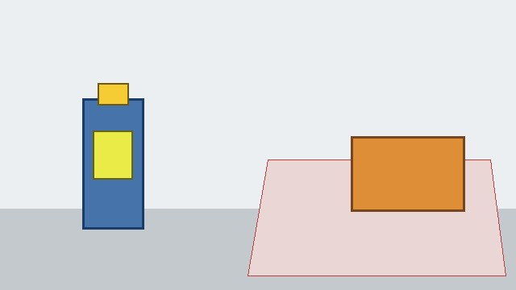
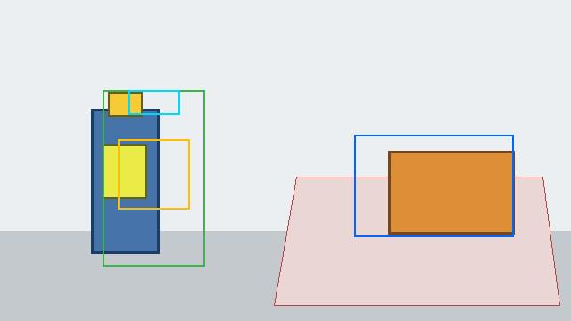
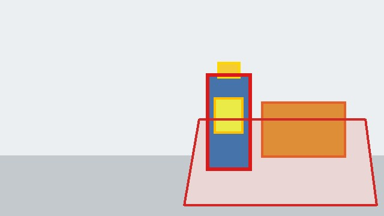
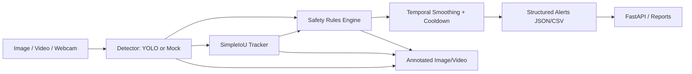

# Industrial Safety Vision

[](https://github.com/IlliaSator/industrial-safety-vision/actions/workflows/ci.yml)

Industrial Safety Vision is a production-style computer vision project for real-time industrial workplace safety monitoring. It combines YOLO-style object detection, worker tracking, a safety-rule engine, temporal alert smoothing, FastAPI serving, Docker packaging, dataset validation, training/evaluation scripts, ONNX export hooks, and benchmark tooling.

This repository currently supports two explicit modes:

1. **Demo/mock mode**: validates the full application pipeline without model weights.
2. **Real model mode**: runs YOLO inference with a pretrained COCO model or a custom PPE checkpoint.

Full PPE safety mode requires a custom model trained on classes such as `person`, `helmet`, `safety_vest`, `forklift`, and `vehicle`. No trained PPE checkpoint or fake metrics are committed.

## Status

| Component | Status |
| --- | --- |
| Package compile check | Passing |
| Unit tests | Passing |
| FastAPI health check | Working in mock mode |
| Image demo | Working in deterministic mock mode |
| Synthetic video demo | Working in deterministic mock mode |
| Real YOLO inference | Supported when a checkpoint/model name is provided |
| Custom PPE training | Supported via YOLO-format dataset |
| ONNX export | Supported when a model checkpoint exists |
| Benchmarking | Working; mock pipeline benchmark included |
| Docker | Configured for mock API mode by default |

## Demo

Synthetic input:



Deterministic annotated output:



Expected safety overlay:



Example alert JSON:

```json
[
  {
    "alert_type": "danger_zone_violation",
    "severity": "critical",
    "track_id": 1,
    "frame_index": 26,
    "message": "Worker #1 entered danger zone 'default_loading_zone'.",
    "metadata": {
      "zone": "default_loading_zone",
      "mode": "synthetic_demo"
    }
  }
]
```

Generate demo assets:

```bash
python scripts/generate_demo_assets.py
```

Run image demo without model weights:

```bash
python scripts/run_image_demo.py --image docs/assets/demo_input.jpg --output data/outputs --mock
```

Run synthetic video pipeline demo without model weights:

```bash
python scripts/run_video_demo.py --synthetic --output data/outputs/synthetic_annotated.gif --max-frames 30
```

Synthetic mode demonstrates system behavior: drawing, tracking, safety rules, alert smoothing, and output serialization. It is not a neural-network accuracy demo.

## Architecture



## What Makes This More Than A YOLO Demo

The project focuses on the ML engineering layer around object detection:

- structured domain objects instead of raw model outputs
- swappable detector interface
- real-time video loop with FPS/latency accounting
- worker tracking
- PPE association logic
- danger-zone and vehicle-proximity rules
- temporal smoothing and cooldown
- API service with metrics
- Docker deployment
- reproducible train/eval/data validation scripts
- ONNX export entrypoint
- benchmark scripts
- model card and error-analysis documentation

## Quickstart

```bash
python -m pip install --upgrade pip
python -m pip install -e ".[dev]"
python -m compileall src tests scripts
python -m pytest -q
ruff check .
```

If GNU Make is available:

```bash
make test
make lint
make demo-image
make demo-video
make benchmark
```

## FastAPI

Start in mock mode:

```bash
$env:INDUSTRIAL_SAFETY_MOCK_DETECTOR="true"
python -m uvicorn industrial_safety_vision.api.main:app --host 0.0.0.0 --port 8000
```

Linux/macOS:

```bash
INDUSTRIAL_SAFETY_MOCK_DETECTOR=true python -m uvicorn industrial_safety_vision.api.main:app --host 0.0.0.0 --port 8000
```

Smoke checks:

```bash
curl http://localhost:8000/health
curl http://localhost:8000/model/info
curl http://localhost:8000/metrics
curl -F "file=@docs/assets/demo_input.jpg" http://localhost:8000/predict/image
```

Swagger UI:

```text
http://localhost:8000/docs
```

## Real Model Inference

COCO smoke test:

```bash
python scripts/run_image_demo.py --image docs/assets/demo_input.jpg --model yolov8n.pt --output data/outputs
```

Custom PPE model:

```bash
python scripts/run_image_demo.py --image docs/assets/demo_input.jpg --model models/best.pt --output data/outputs
python scripts/run_video_demo.py --input data/samples/demo.mp4 --output data/outputs/annotated_demo.mp4 --model models/best.pt
```

`models/best.pt` is intentionally ignored by git. Put local checkpoints under `models/`.

## Dataset And Training

Expected YOLO dataset layout:

```text
data/processed/
  dataset.yaml
  images/train
  images/val
  images/test
  labels/train
  labels/val
  labels/test
```

Validate dataset:

```bash
python -m industrial_safety_vision.data.dataset_validation --config configs/train.yaml
```

Train:

```bash
python -m industrial_safety_vision.training.train_yolo --config configs/train.yaml
```

Evaluate:

```bash
python -m industrial_safety_vision.training.evaluate_yolo --config configs/train.yaml --model models/best.pt --split val
```

Detection metrics such as mAP@0.5 and mAP@0.5:0.95 differ from classification accuracy because a prediction must get both the class and bounding-box localization right.

## Benchmark

The committed benchmark example is a real local run of the mock pipeline, not neural-network inference:

| Backend | Device | Input size | Mean latency | P95 latency | FPS | Mode |
| --- | --- | --- | --- | --- | --- | --- |
| mock_detector_tracking_rules | CPU | 640 | 0.029 ms | 0.051 ms | 34211.44 | mock_pipeline |

Reproduce:

```bash
python scripts/run_benchmark.py --mock --image docs/assets/demo_input.jpg --warmup-runs 3 --benchmark-runs 10
```

Real model benchmark:

```bash
python scripts/run_benchmark.py --model models/best.pt --image docs/assets/demo_input.jpg
```

## ONNX Export

```bash
python scripts/export_onnx.py --model models/best.pt --output-dir models --imgsz 640
```

If the checkpoint is missing, the script exits with a clear message. ONNX files are ignored by git.

## Docker

```bash
docker build -t industrial-safety-vision:local .
docker compose up api
```

The compose service runs in mock mode by default so `/health`, `/model/info`, and `/metrics` work even without model weights.

## Current Limitations

- No custom PPE model is included.
- Demo mode uses deterministic synthetic/mock detections.
- COCO pretrained models do not provide reliable helmet/vest classes.
- PPE association is based on bounding-box overlap and can fail with overlapping people.
- Danger zones require camera/site calibration.
- Safety-critical deployment requires human validation, monitoring, audit logs, and a reviewed escalation process.

## Roadmap

- Train/evaluate a custom PPE model on a documented dataset
- ByteTrack or DeepSORT integration
- RTSP stream support
- Perspective calibration for vehicle proximity
- ONNX/TensorRT optimized inference profile
- Model monitoring and active-learning loop
- Human-in-the-loop alert review
