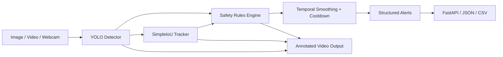

# Industrial Safety Vision

Industrial Safety Vision is a production-style computer vision system for real-time workplace safety monitoring. It detects workers, helmets, safety vests, forklifts/vehicles, tracks workers across frames, generates structured safety alerts, and exposes inference through FastAPI and Docker.

The project is designed as an ML engineering portfolio system, not a toy YOLO notebook. It focuses on the layers around the model: reproducible training, dataset validation, structured inference outputs, real-time constraints, safety-rule smoothing, deployment, benchmarking, tests, and failure analysis.

## Why It Matters

Industrial sites need consistent monitoring for PPE compliance, danger-zone access, and worker/vehicle proximity. Computer vision can help safety teams review incidents faster and detect risky patterns, especially in warehouses, factories, loading zones, and construction-like environments. This repository demonstrates how that kind of system can be structured before production hardening.

## Architecture



## Key Features

- YOLO object detection abstraction with structured `Detection` objects
- Real-time video inference with FPS and latency accounting
- Worker tracking with a pluggable `SimpleIoUTracker`
- PPE compliance checks for helmets and safety vests
- Danger-zone polygon violation detection
- Vehicle/forklift proximity alerts
- Temporal smoothing and cooldown to reduce alert spam
- FastAPI inference service with image/video endpoints
- Docker and docker-compose deployment
- YOLO training and evaluation CLIs
- Dataset validation and train/val/test splitting utilities
- ONNX export and latency benchmark scripts
- Fast pytest suite and GitHub Actions CI

## More Than A YOLO Demo

Unlike a basic object detection demo, this project focuses on the ML engineering layer around the model: dataset checks, reproducible training entrypoints, structured domain objects, real-time video processing, tracking, configurable safety rules, alert smoothing, API serving, Docker deployment, system metrics, benchmarking, and documented failure modes.

## Quickstart

```bash
make install
make test
make lint
```

Run image demo:

```bash
python scripts/run_image_demo.py --image data/samples/sample.jpg --model models/best.pt --output data/outputs
```

Run video demo:

```bash
python scripts/run_video_demo.py --input data/samples/demo.mp4 --output data/outputs/annotated_demo.mp4 --model models/best.pt --conf 0.35 --frame-skip 1
```

Start API locally:

```bash
make api
```

Start with Docker:

```bash
make docker-build
docker compose up api
```

## Dataset

The project supports custom PPE datasets in YOLO format. Sample/demo mode can use small local assets, but full safety mode expects a trained detector with classes such as `person`, `helmet`, `safety_vest`, `forklift`, and `vehicle`.

Expected format:

```text
data/processed/
  dataset.yaml
  images/train
  images/val
  images/test
  labels/train
  labels/val
  labels/test
```

Validate labels and structure:

```bash
make validate-data
```

Create splits from a flat image/label directory:

```bash
python -m industrial_safety_vision.data.split_dataset --images data/raw/images --labels data/raw/labels --output data/processed
```

## Training

Configuration lives in `configs/train.yaml`.

```bash
make train
python -m industrial_safety_vision.training.train_yolo --config configs/train.yaml --epochs 50 --batch-size 16 --image-size 640
```

Training outputs go to local artifact folders such as `runs/` and `reports/`, which are ignored by git. No weights or datasets are committed.

## Evaluation

```bash
make evaluate
python -m industrial_safety_vision.training.evaluate_yolo --config configs/train.yaml --model models/best.pt --split val
```

Detection metrics differ from classification metrics because a prediction must identify both the right class and a sufficiently overlapping bounding box. The evaluation script reports mAP@0.5, mAP@0.5:0.95, precision, recall, and raw Ultralytics metrics when available.

## Real-Time Inference

The video pipeline supports video files, webcam indices, frame skipping, max-frame limits, annotated output video, alerts JSON/CSV, average latency, and measured FPS. Safety rules are configured in `configs/safety_rules.yaml`; tracking settings live in `configs/tracking.yaml`.

## API Usage

```bash
curl http://localhost:8000/health
curl http://localhost:8000/model/info
curl -F "file=@data/samples/sample.jpg" http://localhost:8000/predict/image
curl -F "file=@data/samples/demo.mp4" http://localhost:8000/predict/video
curl http://localhost:8000/alerts
curl http://localhost:8000/metrics
```

More examples are in [docs/api_usage.md](docs/api_usage.md).

## Benchmarking

```bash
make export-onnx
make benchmark
```

No fake benchmark numbers are committed. Run the benchmark locally with a real model to generate `reports/benchmark_results.json`.

| Backend | Device | Input size | Mean latency | P95 latency | FPS | Model size |
| --- | --- | --- | --- | --- | --- | --- |
| PyTorch / Ultralytics | TBD | TBD | Run benchmark | Run benchmark | Run benchmark | Run benchmark |
| ONNX Runtime | TBD | TBD | Run benchmark | Run benchmark | Run benchmark | Run benchmark |

## Model Card Summary

Intended use: assist industrial safety review by detecting PPE and spatial safety-rule violations in camera footage.

Limitations: performance depends on dataset quality, camera angle, lighting, occlusion, and calibration. PPE association is approximate and should be validated with site-specific data.

This project is not a replacement for certified safety systems or human supervision.

## Error Analysis

Common failure modes include helmets missed under occlusion, reflective vest false positives, small workers in the background, low-light frames, motion blur, unusual camera angles, overlapping workers, and PPE association errors when equipment boxes overlap the wrong person.

## Project Limitations

- Requires a custom PPE dataset for production-quality safety classes
- Camera geometry and danger zones must be calibrated per site
- Current tracker is simple IoU matching, not re-identification
- ONNX backend currently focuses on execution/benchmark scaffolding
- Safety-critical deployments require additional validation, monitoring, and human review

## Roadmap

- ByteTrack integration
- DeepSORT integration
- RTSP stream support
- Active learning loop
- Model monitoring and drift checks
- TensorRT optimization
- ROS2 integration
- Edge deployment profile
- Human-in-the-loop alert review
