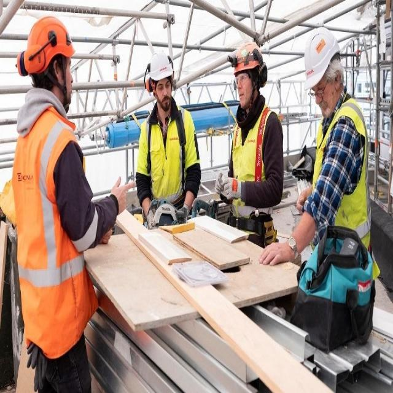
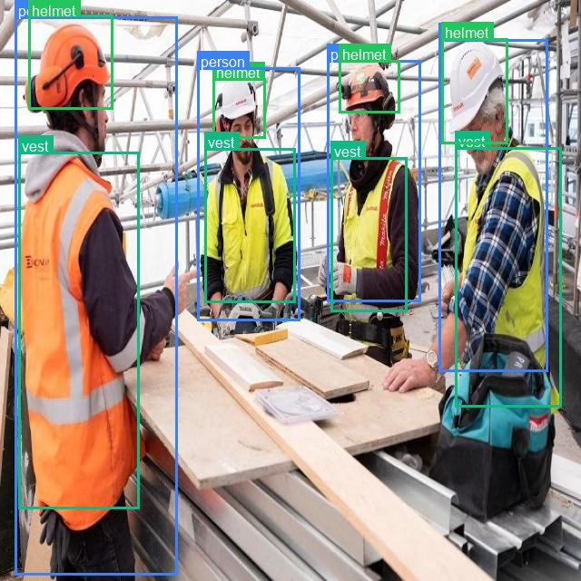
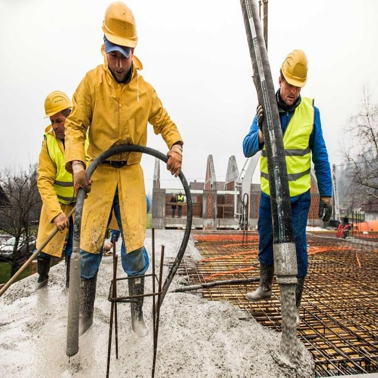
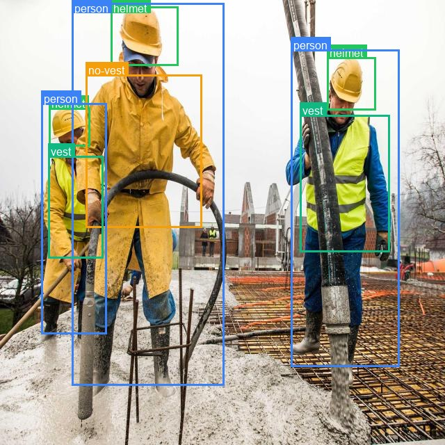
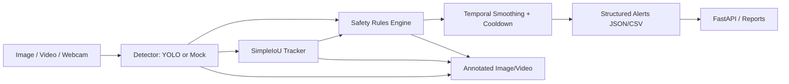

# Industrial Safety Vision

[](https://github.com/IlliaSator/industrial-safety-vision/actions/workflows/ci.yml)

Industrial Safety Vision is a production-style computer vision project for workplace safety monitoring. The goal is not just to run YOLO on a picture, but to show the engineering around a real CV system: dataset checks, training and evaluation entrypoints, structured detections, video inference, worker tracking, temporal alert smoothing, an API service, Docker, and benchmarking.

This repository currently supports two explicit modes:

1. **Demo/mock mode**: runs the full application pipeline without model weights. This is useful for CI, API smoke tests, and portfolio review.
2. **Real model mode**: runs YOLO inference with a pretrained model name such as `yolo11n.pt` or with a custom PPE checkpoint.

Full PPE safety mode still needs a properly trained custom checkpoint. The repo includes a public PPE dataset workflow and a one-epoch smoke-training run, but it does not pretend that this is a production-grade safety model.

## Status

| Component | Status |
| --- | --- |
| Package compile check | Passing |
| Unit tests | Passing |
| FastAPI health check | Working in mock mode |
| Dataset examples | Real PPE dataset frames included under `docs/assets/` |
| Image demo | Working in mock mode and real YOLO mode |
| Video demo | Working with synthetic/mock video pipeline |
| Real YOLO inference | Supported when a checkpoint/model name is provided |
| Custom PPE training | Smoke-tested on RF100 construction-safety dataset |
| ONNX export | Supported when a model checkpoint exists |
| Benchmarking | Mock pipeline and real `yolo11n.pt` CPU benchmark included |
| Docker | Configured for mock API mode by default |

## Demo

Here are real frames from the recommended PPE dataset. These images are small committed examples only; the full dataset stays under `data/raw/` and is ignored by git. The source dataset is distributed as CC BY 4.0, so keep attribution if you reuse the examples.

| Dataset frame | YOLO label overlay |
| --- | --- |
|  |  |
|  |  |

Short preview GIF:


The overlays above come from the dataset labels, not from a claimed production model. They are included so the repository immediately shows the kind of scenes the system is designed for: people on worksites, helmets, safety vests, missing PPE cases, and crowded camera views where association can get tricky.

For a no-weights pipeline check, the project still ships a deterministic mock demo. It is deliberately boring in a good way: the same input produces the same detections, tracking IDs, safety-rule output, and alert JSON every time.

Example alert JSON:

```json
[
  {
    "alert_type": "danger_zone_violation",
    "severity": "critical",
    "track_id": 1,
    "frame_index": 26,
    "message": "Worker #1 entered danger zone 'default_loading_zone'.",
    "metadata": {
      "zone": "default_loading_zone",
      "mode": "synthetic_demo"
    }
  }
]
```

Generate or refresh demo assets:

```bash
python scripts/generate_demo_assets.py
```

Run image demo without model weights:

```bash
python scripts/run_image_demo.py --image docs/assets/demo_input.jpg --output data/outputs --mock
```

Run synthetic video pipeline demo without model weights:

```bash
python scripts/run_video_demo.py --synthetic --output data/outputs/synthetic_annotated.gif --max-frames 30
```

Synthetic/mock mode demonstrates system behavior: drawing, tracking, safety rules, alert smoothing, API responses, and output serialization. It is not a neural-network accuracy demo.

## Architecture



## What Makes This More Than A YOLO Demo

The project focuses on the ML engineering layer around object detection:

- structured domain objects instead of raw model outputs
- swappable detector interface
- real-time video loop with FPS/latency accounting
- worker tracking
- PPE association logic
- danger-zone and vehicle-proximity rules
- temporal smoothing and cooldown
- API service with metrics
- Docker deployment
- reproducible train/eval/data validation scripts
- ONNX export entrypoint
- benchmark scripts
- model card and error-analysis documentation

## Quickstart

```bash
python -m pip install --upgrade pip
python -m pip install -e ".[dev]"
python -m compileall src tests scripts
python -m pytest -q
ruff check .
```

If GNU Make is available:

```bash
make test
make lint
make download-data
make validate-data
make demo-image
make demo-video
make benchmark
```

## FastAPI

Start in mock mode:

```bash
$env:INDUSTRIAL_SAFETY_MOCK_DETECTOR="true"
python -m uvicorn industrial_safety_vision.api.main:app --host 0.0.0.0 --port 8000
```

Linux/macOS:

```bash
INDUSTRIAL_SAFETY_MOCK_DETECTOR=true python -m uvicorn industrial_safety_vision.api.main:app --host 0.0.0.0 --port 8000
```

Smoke checks:

```bash
curl http://localhost:8000/health
curl http://localhost:8000/model/info
curl http://localhost:8000/metrics
curl -F "file=@docs/assets/dataset_ppe_example_01.jpg" http://localhost:8000/predict/image
```

Swagger UI:

```text
http://localhost:8000/docs
```

## Real Model Inference

COCO smoke test:

```bash
python scripts/run_image_demo.py --image docs/assets/dataset_ppe_example_01.jpg --model yolo11n.pt --output data/outputs
```

Custom PPE model:

```bash
python scripts/run_image_demo.py --image docs/assets/dataset_ppe_example_01.jpg --model models/best.pt --output data/outputs
python scripts/run_video_demo.py --input data/samples/demo.mp4 --output data/outputs/annotated_demo.mp4 --model models/best.pt
```

`models/best.pt` is intentionally ignored by git. Put local checkpoints under `models/`.

## Dataset And Training

Recommended public starter dataset:

- Hugging Face: [`LibreYOLO/construction-safety-gsnvb`](https://huggingface.co/datasets/LibreYOLO/construction-safety-gsnvb)
- Original Roboflow Universe dataset: [`construction-safety-gsnvb`](https://universe.roboflow.com/roboflow-100/construction-safety-gsnvb/dataset/1)
- License: CC-BY-4.0
- Classes: `helmet`, `no-helmet`, `no-vest`, `person`, `vest`
- Splits validated locally: 997 train images, 119 validation images, 90 test images

Download locally:

```bash
python -m pip install huggingface_hub
python scripts/download_ppe_dataset.py --output data/raw/construction-safety-gsnvb
```

Expected YOLO dataset layout:

```text
data/processed/
  dataset.yaml
  images/train
  images/val
  images/test
  labels/train
  labels/val
  labels/test
```

The validator also supports the common Ultralytics/Roboflow layout with `train/images`, `train/labels`, `valid/images`, and `test/images`.

Validate dataset:

```bash
python -m industrial_safety_vision.data.dataset_validation \
  --dataset-yaml data/raw/construction-safety-gsnvb/data.yaml \
  --report reports/dataset_summary_construction_safety.json
```

Smoke train on the recommended dataset:

```bash
python -m industrial_safety_vision.training.train_yolo \
  --config configs/train.yaml \
  --dataset data/raw/construction-safety-gsnvb/data.yaml \
  --model yolo11n.pt \
  --epochs 1 \
  --batch-size 2 \
  --image-size 320 \
  --device 0
```

Evaluate:

```bash
python -m industrial_safety_vision.training.evaluate_yolo \
  --config configs/train.yaml \
  --dataset data/raw/construction-safety-gsnvb/data.yaml \
  --model runs/.../weights/best.pt \
  --split val \
  --device 0
```

Detection metrics such as mAP@0.5 and mAP@0.5:0.95 differ from classification accuracy because a prediction must get both the class and bounding-box localization right.

One local smoke-training run was completed on an NVIDIA MX450 with `yolo11n.pt`, 1 epoch, `imgsz=320`, `batch=2`. These numbers prove the training/evaluation pipeline runs; they are not production-quality model claims:

| Metric | Value |
| --- | ---: |
| Precision | 0.660 |
| Recall | 0.457 |
| mAP@0.5 | 0.448 |
| mAP@0.5:0.95 | 0.217 |

## Benchmark

The project now includes both a mock-pipeline benchmark and a real YOLO CPU benchmark.

| Backend | Device | Input size | Mean latency | P95 latency | FPS | Mode |
| --- | --- | --- | --- | --- | --- | --- |
| mock_detector_tracking_rules | CPU | 640 | 0.036 ms | 0.048 ms | 28011.21 | mock_pipeline |
| pytorch_ultralytics `yolo11n.pt` | CPU | 640 | 69.728 ms | 75.878 ms | 14.34 | real_model |

Reproduce:

```bash
python scripts/run_benchmark.py --mock --image docs/assets/demo_input.jpg --warmup-runs 3 --benchmark-runs 10
```

Real model benchmark:

```bash
python scripts/run_benchmark.py --model yolo11n.pt --image docs/assets/dataset_ppe_example_01.jpg --device cpu
```

## ONNX Export

```bash
python scripts/export_onnx.py --model models/best.pt --output-dir models --imgsz 640
```

If the checkpoint is missing, the script exits with a clear message. ONNX files are ignored by git.

## Docker

```bash
docker build -t industrial-safety-vision:local .
docker compose up api
```

The compose service runs in mock mode by default so `/health`, `/model/info`, and `/metrics` work even without model weights.

For a heavier image with YOLO/OpenCV runtime dependencies:

```bash
docker build --build-arg INSTALL_ML_DEPS=true -t industrial-safety-vision:ml .
```

## Current Limitations

- No custom PPE model is included.
- Demo mode uses deterministic synthetic/mock detections.
- COCO pretrained models do not provide reliable helmet/vest classes.
- PPE association is based on bounding-box overlap and can fail with overlapping people.
- Danger zones require camera/site calibration.
- Safety-critical deployment requires human validation, monitoring, audit logs, and a reviewed escalation process.

## Roadmap

- Train/evaluate a custom PPE model on a documented dataset
- ByteTrack or DeepSORT integration
- RTSP stream support
- Perspective calibration for vehicle proximity
- ONNX/TensorRT optimized inference profile
- Model monitoring and active-learning loop
- Human-in-the-loop alert review

---

# Industrial Safety Vision (RU)

[](https://github.com/IlliaSator/industrial-safety-vision/actions/workflows/ci.yml)

Industrial Safety Vision - это production-style проект по Computer Vision для мониторинга промышленной безопасности. Идея проекта не в том, чтобы просто запустить YOLO на одной картинке, а в том, чтобы показать инженерную часть реальной CV-системы: проверку датасета, обучение и оценку модели, структурированные результаты инференса, обработку видео, трекинг работников, сглаживание алертов во времени, FastAPI-сервис, Docker и бенчмарки.

Сейчас проект поддерживает два режима:

1. **Demo/mock mode**: запускает весь пайплайн без весов модели. Этот режим удобен для CI, smoke-тестов API и быстрой проверки проекта.
2. **Real model mode**: запускает YOLO-инференс с pretrained-моделью вроде `yolo11n.pt` или с кастомным PPE-чекпоинтом.

Полноценный PPE safety mode требует нормально обученной кастомной модели. В репозитории есть workflow для публичного PPE-датасета и one-epoch smoke-training, но проект честно не выдает этот smoke-run за production-ready safety model.

## Статус

| Компонент | Статус |
| --- | --- |
| Compile check пакета | Проходит |
| Unit-тесты | Проходят |
| FastAPI health check | Работает в mock-режиме |
| Примеры датасета | Реальные PPE-кадры лежат в `docs/assets/` |
| Image demo | Работает в mock mode и real YOLO mode |
| Video demo | Работает через synthetic/mock video pipeline |
| Real YOLO inference | Поддерживается при наличии checkpoint/model name |
| Custom PPE training | Smoke-tested на RF100 construction-safety dataset |
| ONNX export | Поддерживается при наличии checkpoint |
| Benchmarking | Есть mock pipeline benchmark и real `yolo11n.pt` CPU benchmark |
| Docker | По умолчанию настроен для mock API mode |

## Демо

Ниже реальные кадры из рекомендованного PPE-датасета. Это небольшие примеры, закоммиченные только для README. Полный датасет хранится локально в `data/raw/` и игнорируется git. Исходный датасет распространяется под CC BY 4.0, поэтому при переиспользовании примеров нужно сохранять attribution.

| Кадр из датасета | YOLO-разметка |
| --- | --- |
|  |  |
|  |  |

Короткий preview GIF:


Разметка на изображениях выше взята из labels датасета. Это не попытка показать fake predictions от production-модели. Эти кадры нужны, чтобы сразу было видно, под какие сцены проект построен: работники на площадке, каски, жилеты, отсутствие PPE, плотные кадры и пересечения людей, где association logic может ошибаться.

Для проверки пайплайна без весов в проекте также есть deterministic mock demo. Он специально воспроизводимый: один и тот же вход дает одинаковые detections, track IDs, safety alerts и JSON-выход.

Пример alert JSON:

```json
[
  {
    "alert_type": "danger_zone_violation",
    "severity": "critical",
    "track_id": 1,
    "frame_index": 26,
    "message": "Worker #1 entered danger zone 'default_loading_zone'.",
    "metadata": {
      "zone": "default_loading_zone",
      "mode": "synthetic_demo"
    }
  }
]
```

Сгенерировать или обновить demo assets:

```bash
python scripts/generate_demo_assets.py
```

Запустить image demo без весов модели:

```bash
python scripts/run_image_demo.py --image docs/assets/demo_input.jpg --output data/outputs --mock
```

Запустить synthetic video demo без весов модели:

```bash
python scripts/run_video_demo.py --synthetic --output data/outputs/synthetic_annotated.gif --max-frames 30
```

Synthetic/mock mode показывает поведение системы: отрисовку, трекинг, safety rules, alert smoothing, API responses и сохранение результатов. Это не демонстрация качества нейросетевой модели.

## Архитектура


## Почему это больше, чем YOLO demo

Проект сфокусирован на ML engineering слое вокруг object detection:

- структурированные domain objects вместо сырых model outputs
- заменяемый detector interface
- real-time video loop с расчетом FPS и latency
- worker tracking
- PPE association logic
- danger-zone и vehicle-proximity rules
- temporal smoothing и cooldown для алертов
- API service с метриками
- Docker deployment
- воспроизводимые scripts для train/eval/data validation
- ONNX export entrypoint
- benchmark scripts
- model card и error-analysis документация

## Быстрый старт

```bash
python -m pip install --upgrade pip
python -m pip install -e ".[dev]"
python -m compileall src tests scripts
python -m pytest -q
ruff check .
```

Если установлен GNU Make:

```bash
make test
make lint
make download-data
make validate-data
make demo-image
make demo-video
make benchmark
```

## FastAPI

Запуск в mock mode:

```bash
$env:INDUSTRIAL_SAFETY_MOCK_DETECTOR="true"
python -m uvicorn industrial_safety_vision.api.main:app --host 0.0.0.0 --port 8000
```

Linux/macOS:

```bash
INDUSTRIAL_SAFETY_MOCK_DETECTOR=true python -m uvicorn industrial_safety_vision.api.main:app --host 0.0.0.0 --port 8000
```

Smoke checks:

```bash
curl http://localhost:8000/health
curl http://localhost:8000/model/info
curl http://localhost:8000/metrics
curl -F "file=@docs/assets/dataset_ppe_example_01.jpg" http://localhost:8000/predict/image
```

Swagger UI:

```text
http://localhost:8000/docs
```

## Real Model Inference

COCO smoke test:

```bash
python scripts/run_image_demo.py --image docs/assets/dataset_ppe_example_01.jpg --model yolo11n.pt --output data/outputs
```

Кастомная PPE-модель:

```bash
python scripts/run_image_demo.py --image docs/assets/dataset_ppe_example_01.jpg --model models/best.pt --output data/outputs
python scripts/run_video_demo.py --input data/samples/demo.mp4 --output data/outputs/annotated_demo.mp4 --model models/best.pt
```

`models/best.pt` специально игнорируется git. Локальные checkpoints нужно класть в `models/`.

## Датасет и обучение

Рекомендованный публичный стартовый датасет:

- Hugging Face: [`LibreYOLO/construction-safety-gsnvb`](https://huggingface.co/datasets/LibreYOLO/construction-safety-gsnvb)
- Original Roboflow Universe dataset: [`construction-safety-gsnvb`](https://universe.roboflow.com/roboflow-100/construction-safety-gsnvb/dataset/1)
- License: CC-BY-4.0
- Classes: `helmet`, `no-helmet`, `no-vest`, `person`, `vest`
- Локально проверенные splits: 997 train images, 119 validation images, 90 test images

Скачать локально:

```bash
python -m pip install huggingface_hub
python scripts/download_ppe_dataset.py --output data/raw/construction-safety-gsnvb
```

Ожидаемый YOLO dataset layout:

```text
data/processed/
  dataset.yaml
  images/train
  images/val
  images/test
  labels/train
  labels/val
  labels/test
```

Валидатор также поддерживает распространенный Ultralytics/Roboflow layout: `train/images`, `train/labels`, `valid/images`, `test/images`.

Проверить датасет:

```bash
python -m industrial_safety_vision.data.dataset_validation \
  --dataset-yaml data/raw/construction-safety-gsnvb/data.yaml \
  --report reports/dataset_summary_construction_safety.json
```

Smoke train на рекомендованном датасете:

```bash
python -m industrial_safety_vision.training.train_yolo \
  --config configs/train.yaml \
  --dataset data/raw/construction-safety-gsnvb/data.yaml \
  --model yolo11n.pt \
  --epochs 1 \
  --batch-size 2 \
  --image-size 320 \
  --device 0
```

Evaluation:

```bash
python -m industrial_safety_vision.training.evaluate_yolo \
  --config configs/train.yaml \
  --dataset data/raw/construction-safety-gsnvb/data.yaml \
  --model runs/.../weights/best.pt \
  --split val \
  --device 0
```

Detection metrics вроде mAP@0.5 и mAP@0.5:0.95 отличаются от classification accuracy: детектор должен правильно определить и класс, и локализацию bounding box.

Один локальный smoke-training run был выполнен на NVIDIA MX450 с `yolo11n.pt`, 1 epoch, `imgsz=320`, `batch=2`. Эти числа показывают, что training/evaluation pipeline запускается, но это не production-quality метрики модели:

| Metric | Value |
| --- | ---: |
| Precision | 0.660 |
| Recall | 0.457 |
| mAP@0.5 | 0.448 |
| mAP@0.5:0.95 | 0.217 |

## Benchmark

В проекте есть mock-pipeline benchmark и real YOLO CPU benchmark.

| Backend | Device | Input size | Mean latency | P95 latency | FPS | Mode |
| --- | --- | --- | --- | --- | --- | --- |
| mock_detector_tracking_rules | CPU | 640 | 0.036 ms | 0.048 ms | 28011.21 | mock_pipeline |
| pytorch_ultralytics `yolo11n.pt` | CPU | 640 | 69.728 ms | 75.878 ms | 14.34 | real_model |

Воспроизвести:

```bash
python scripts/run_benchmark.py --mock --image docs/assets/demo_input.jpg --warmup-runs 3 --benchmark-runs 10
```

Real model benchmark:

```bash
python scripts/run_benchmark.py --model yolo11n.pt --image docs/assets/dataset_ppe_example_01.jpg --device cpu
```

## ONNX Export

```bash
python scripts/export_onnx.py --model models/best.pt --output-dir models --imgsz 640
```

Если checkpoint отсутствует, скрипт завершится с понятным сообщением. ONNX-файлы игнорируются git.

## Docker

```bash
docker build -t industrial-safety-vision:local .
docker compose up api
```

Compose service по умолчанию запускается в mock mode, поэтому `/health`, `/model/info` и `/metrics` работают даже без весов модели.

Для более тяжелого образа с YOLO/OpenCV runtime dependencies:

```bash
docker build --build-arg INSTALL_ML_DEPS=true -t industrial-safety-vision:ml .
```

## Текущие ограничения

- В репозиторий не включена custom PPE model.
- Demo mode использует deterministic synthetic/mock detections.
- COCO pretrained models не дают надежные классы helmet/vest.
- PPE association основан на overlap bounding boxes и может ошибаться при пересечении людей.
- Danger zones требуют calibration под конкретную камеру и площадку.
- Safety-critical deployment требует human validation, monitoring, audit logs и согласованный escalation process.

## Roadmap

- Train/evaluate custom PPE model на документированном датасете
- Интеграция ByteTrack или DeepSORT
- RTSP stream support
- Perspective calibration для vehicle proximity
- ONNX/TensorRT optimized inference profile
- Model monitoring и active-learning loop
- Human-in-the-loop alert review
